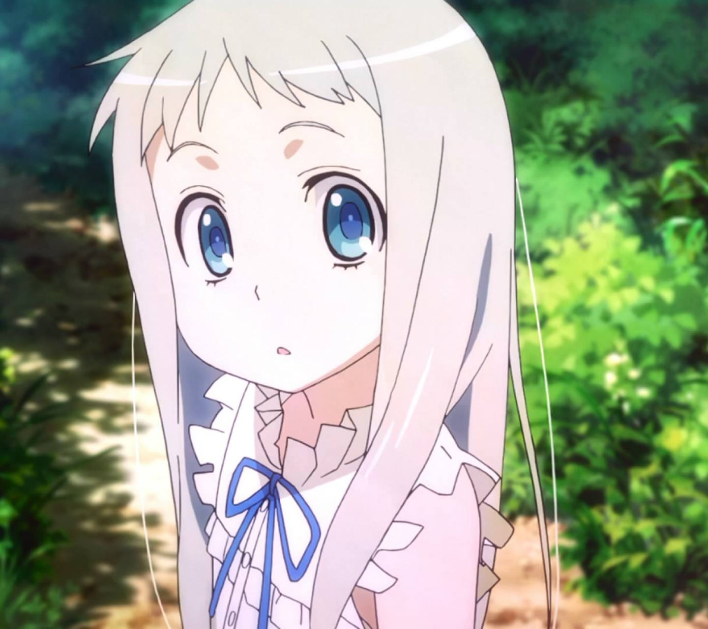
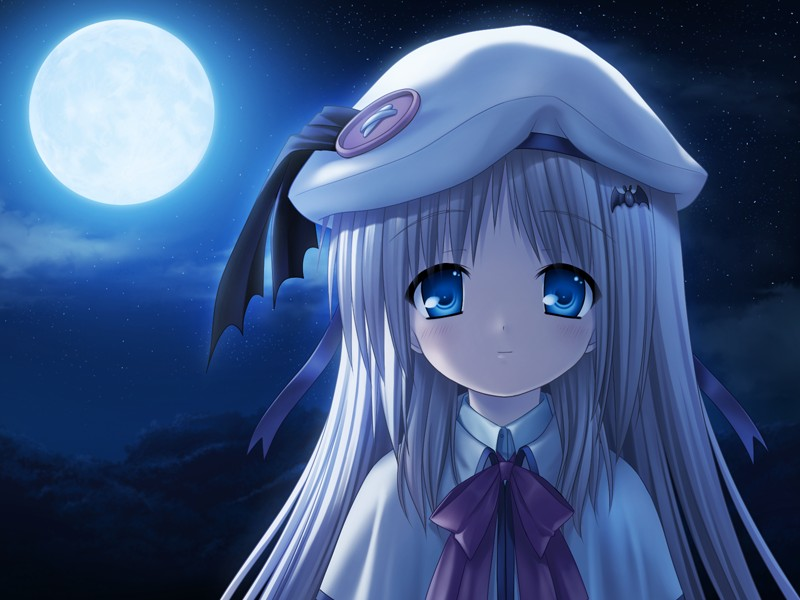

# MenmaVsWafterRecognizer
A CNN Trial for differentiating two animation characters, one of which is my waifu

## Intro

This is [Honma Meiko](https://mywaifulist.moe/waifu/meiko-honma) from [Anohana](https://en.wikipedia.org/wiki/Anohana)

---

This is [Kudryavka Noumi](https://littlebusters.fandom.com/wiki/Kudryavka_Noumi) from [Kud Wafter](https://en.wikipedia.org/wiki/Kud_Wafter)

## What to do

For a period of time I had a trouble of dividing both characters form each other since they resemble so much from the aspect of their appearances as far as I was concerned. So the idea here is simple, build up a `Convolution Neural Network` using comprehensive APIs provided by `Tensorflow`, fit a reasonable model to help differentiating Menma, who is my waifu, from Kudryavka Noumi from which GAL I have never played before
